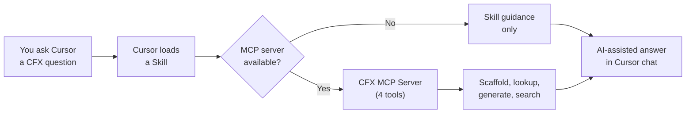

<p align="center">
  
</p>

<h1 align="center">CFX Developer Tools</h1>

<p align="center">
  <strong>AI-powered development toolkit for FiveM and RedM resource development in Cursor IDE.</strong>
</p>

<p align="center">
  <a href="https://creativecommons.org/licenses/by-nc-nd/4.0/"></a>
  <a href="CHANGELOG.md"></a>
  <a href="https://github.com/TMHSDigital/CFX-Developer-Tools/stargazers"></a>
</p>

<p align="center">
  <a href="#features">Features</a> &bull;
  <a href="#quick-start">Quick Start</a> &bull;
  <a href="#mcp-server">MCP Server</a> &bull;
  <a href="#skills-9">Skills</a> &bull;
  <a href="#rules-6">Rules</a> &bull;
  <a href="#roadmap">Roadmap</a>
</p>

---

<p align="center">
  9 skills &nbsp;&bull;&nbsp; 6 rules &nbsp;&bull;&nbsp; 4 MCP tools &nbsp;&bull;&nbsp; 12,000+ natives &nbsp;&bull;&nbsp; 20 snippets &nbsp;&bull;&nbsp; 7 templates
</p>

Scaffold complete FiveM/RedM resources, look up native functions, generate manifests, detect frameworks, and write optimized scripts in Lua, JavaScript, and C# -- all from within Cursor's AI chat. Covers the full CFX development lifecycle from project setup to database integration.

## How It Works



**Skills** teach Cursor how to handle CFX development prompts. **Rules** enforce FiveM/RedM best practices in your code. The **MCP server** provides programmatic tools so skills can scaffold resources, look up natives, and generate manifests directly.

## Quick Start

1. **Clone the repo**

```bash
git clone https://github.com/TMHSDigital/CFX-Developer-Tools.git
```

2. **Open in Cursor**

```
File > Open Folder > CFX-Developer-Tools
```

3. **Install MCP server dependencies**

```bash
cd mcp-server
pip install -r requirements.txt
```

4. **Start building** -- ask the AI agent to scaffold a resource, look up a native, or generate a manifest.

## Features

- **Resource scaffolding** -- Generate complete resources in Lua, JavaScript, or C# with proper `fxmanifest.lua`
- **Framework detection** -- Automatically detect and adapt to ESX, QBCore, ox_core, or standalone
- **Native function lookup** -- Search GTA5/RDR3 native functions by name or description via MCP tools
- **Performance-aware coding rules** -- Catch common mistakes (`Wait(0)` in loops, runtime hashing, etc.)
- **Snippet library** -- 20 copy-paste-ready code patterns across all three runtimes
- **NUI development support** -- Skills and patterns for building in-game web UIs
- **Database integration** -- oxmysql query patterns, schema templates, and migration guidance
- **Event reference** -- Searchable database of common FiveM/RedM events

<details>
<summary><strong>Supported Frameworks</strong></summary>

&nbsp;

| Framework | Status |
|:----------|:-------|
| ESX | Supported |
| QBCore | Supported |
| ox_core | Supported |
| Standalone | Supported |

</details>

<details>
<summary><strong>Supported Languages</strong></summary>

&nbsp;

| Language | Client | Server |
|:---------|:-------|:-------|
| Lua | Yes | Yes |
| JavaScript | Yes | Yes |
| C# | Yes | Yes |

</details>

<details>
<summary><strong>Supported Games</strong></summary>

&nbsp;

| Game | Platform |
|:-----|:---------|
| GTA5 | FiveM |
| RDR3 | RedM |

</details>

## Skills (9)

| Skill | What it does |
|:------|:-------------|
| **Resource Scaffolding** | Generate complete resource boilerplate for any framework and language |
| **Native Functions** | Look up GTA5/RDR3 natives by name, hash, or description |
| **fxmanifest** | Author and validate `fxmanifest.lua` files with correct directives |
| **Client-Server Patterns** | Correct event communication, threading, and state sync patterns |
| **Framework Detection** | Auto-detect ESX, QBCore, ox_core, or standalone and adapt code accordingly |
| **Performance Optimization** | Identify and fix CFX-specific performance pitfalls |
| **NUI Development** | Build in-game web UIs with proper message passing and devtools setup |
| **Database Integration** | oxmysql queries, schema design, migrations, and connection pooling |
| **State Bags** | Modern data sync with Entity/Player/Global state bags, change handlers, and security |

## Rules (6)

| Rule | What it does |
|:-----|:-------------|
| **Lua Conventions** | Enforces FiveM Lua idioms -- locals, proper event handlers, Citizen threading |
| **JavaScript Conventions** | Enforces CFX JavaScript patterns -- async/await, proper exports, event typing |
| **C# Conventions** | Enforces CitizenFX C# patterns -- `[FromSource]`, `BaseScript`, tick handlers |
| **fxmanifest Standards** | Validates manifest structure, version strings, dependency declarations |
| **Security Best Practices** | Flags server-side validation gaps, exposed endpoints, insecure patterns |
| **Performance Rules** | Catches `Wait(0)`, runtime hashing, unnecessary tick handlers, memory leaks |

## Snippets (20)

<details>
<summary><strong>Lua (10)</strong></summary>

&nbsp;

| Snippet | Description |
|:--------|:------------|
| `client-event.lua` | Client-side event handler template |
| `server-event.lua` | Server-side event handler with source validation |
| `register-command.lua` | Command registration with permission checks |
| `thread-loop.lua` | Citizen thread with proper `Wait()` usage |
| `nui-callback.lua` | NUI callback handler for client-side |
| `export-function.lua` | Exported function pattern |
| `config-template.lua` | Shared config file structure |
| `state-bag-entity.lua` | Entity state bag set/read pattern |
| `state-bag-player.lua` | Player state bag set/read pattern |
| `state-bag-handler.lua` | State bag change handler |

</details>

<details>
<summary><strong>JavaScript (7)</strong></summary>

&nbsp;

| Snippet | Description |
|:--------|:------------|
| `client-event.js` | Client-side event handler |
| `server-event.js` | Server-side event handler |
| `register-command.js` | Command registration |
| `thread-loop.js` | Tick-based loop pattern |
| `nui-callback.js` | NUI callback registration |
| `state-bag-entity.js` | Entity state bag set/read pattern |
| `state-bag-handler.js` | State bag change handler |

</details>

<details>
<summary><strong>C# (3)</strong></summary>

&nbsp;

| Snippet | Description |
|:--------|:------------|
| `base-script.cs` | `BaseScript` class template |
| `tick-handler.cs` | Tick handler with async pattern |
| `register-command.cs` | Command registration with attributes |

</details>

## Templates (7)

| Template | Description |
|:---------|:------------|
| **Standalone** | Minimal Lua resource -- no framework dependency |
| **ESX** | ESX Legacy-ready resource with `es_extended` integration |
| **QBCore** | QBCore-ready resource with `qb-core` integration |
| **ox_core** | ox_core-ready resource with `ox_lib` integration |
| **JavaScript** | Full JS resource with client/server structure |
| **C#** | .NET resource with `.csproj`, compiled DLL pattern |
| **NUI Vite** | Modern NUI with Vite + React, postMessage bridge, and HMR |

## MCP Server

The companion MCP server provides programmatic tools that Cursor's AI agent can call directly. Configuration lives in `.cursor/mcp.json`.

**Prerequisites:** Python 3.10+

```bash
cd mcp-server
pip install -r requirements.txt
```

The server starts automatically when Cursor invokes an MCP tool.

<details>
<summary><strong>Available Tools (4)</strong></summary>

&nbsp;

| Tool | Description |
|:-----|:------------|
| `scaffold_resource_tool` | Create a new resource with boilerplate files for any framework/language combo |
| `lookup_native_tool` | Search natives by name, hash, description, or category. Browse namespaces. |
| `generate_manifest_tool` | Generate a complete `fxmanifest.lua` with correct directives |
| `search_events_tool` | Search the event reference database by name, side, or keyword |

</details>

<details>
<summary><strong>Usage Examples</strong></summary>

&nbsp;

**Scaffold a resource:**
```
Create a new QBCore resource called "qb-garage" with client and server scripts in Lua
```

**Look up a native:**
```
What native function gets a vehicle's current speed?
```

**Generate a manifest:**
```
Generate an fxmanifest.lua for an ESX resource with NUI, targeting FiveM only
```

**Search events:**
```
What events fire when a player connects to the server?
```

</details>

## Project Structure

```
CFX-Developer-Tools/
  .cursor-plugin/      Plugin manifest
  .cursor/             MCP server configuration
  skills/              AI skill files (9 skills)
  rules/               Coding convention rules (6 rules)
  snippets/            Code snippets -- Lua, JS, C# (20 files)
  templates/           Resource starter templates (7 sets)
  mcp-server/          Python MCP server and data files
  docs/                Architecture, roadmap, contributing guide
  assets/              Logo and images
  .github/             CI/CD workflows
```

## Roadmap

See [docs/ROADMAP.md](docs/ROADMAP.md) for the full project roadmap.

<details>
<summary><strong>Release Plan</strong></summary>

&nbsp;

| Version | Milestone | Status |
|:--------|:----------|:-------|
| **v0.1.x** | Foundation -- skills, rules, snippets, templates, MCP server, CI/CD | Done |
| **v0.2.0** | AGENTS.md and .cursorrules for AI agent guidance | Done |
| **v0.3.0** | Native DB expansion -- 6300+ GTA5, 5800+ RDR3, category browsing, deprecation flags | **Current** |
| **v0.4.0** | Documentation search -- FiveM docs integration via MCP | Planned |
| **v0.5.0** | Event reference expansion -- 100+ events with examples | Planned |
| **v0.6.0** | Framework auto-detection -- runtime detection from project files | Planned |
| **v1.0.0** | Stable release -- marketplace listing, full documentation | Planned |

</details>

## Contributing

See [docs/CONTRIBUTING.md](docs/CONTRIBUTING.md) for guidelines on adding skills, rules, and improvements.

## Support

If this plugin is useful to you, consider [sponsoring the project](https://github.com/sponsors/TMHSDigital).

## License

CC BY-NC-ND 4.0 -- see [LICENSE](LICENSE) for details.

<details>
<summary><strong>CFX Reference Links</strong></summary>

&nbsp;

- [FiveM Documentation](https://docs.fivem.net/docs/)
- [FiveM Native Reference](https://docs.fivem.net/natives/)
- [RedM Native Reference](https://rdr3natives.com/)
- [Cfx.re Forums](https://forum.cfx.re/)
- [Cfx.re Platform](https://cfx.re/)

</details>

---

<p align="center">
  <strong>Built by <a href="https://github.com/TMHSDigital">TMHSDigital</a></strong>
</p>
