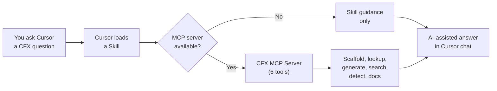

# CFX Developer Tools

**AI-powered development toolkit for FiveM and RedM resource development in Cursor IDE.**

9 skills -- 6 rules -- 6 MCP tools -- 12,000+ natives -- 101 events -- 24 snippets -- 11 templates

---

## What is this?

CFX Developer Tools is a plugin for [Cursor](https://www.cursor.com/) that teaches its AI assistant how to build FiveM and RedM resources. Once installed, you can ask the AI to:

- Scaffold a complete resource in Lua, JavaScript, or C#
- Look up GTA5 or RDR3 native functions by name or description
- Generate a correct `fxmanifest.lua` with all the right directives
- Detect which framework your project uses (ESX, QBCore, Qbox, ox_core, VORP, RSG)
- Search the FiveM/RedM documentation index
- Write code that follows FiveM/RedM best practices automatically

## Quick start

```bash
git clone https://github.com/TMHSDigital/CFX-Developer-Tools.git
cd mcp-server && pip install -r requirements.txt
```

Open the `CFX-Developer-Tools` folder in Cursor, then ask the AI to scaffold a resource, look up a native, or generate a manifest.

For a detailed walkthrough, see the [Getting Started guide](GETTING-STARTED.md).

## Features

- **Resource scaffolding** -- Generate complete resources in Lua, JavaScript, or C# with proper `fxmanifest.lua`
- **Framework detection** -- Automatically detect and adapt to ESX, QBCore, Qbox, ox_core, VORP, RSG, or standalone
- **Native function lookup** -- Search 12,000+ GTA5/RDR3 native functions by name, hash, or description
- **Event reference** -- Searchable database of 101 events across CFX, ESX, QBCore, Qbox, ox_core, VORP, and RSG
- **Documentation search** -- Query the FiveM/RedM docs index by keyword or section
- **Performance-aware coding rules** -- Catch common mistakes like `Wait(0)` in loops, runtime hashing, and more
- **Snippet library** -- 24 copy-paste-ready code patterns across Lua, JavaScript, and C#
- **NUI development** -- Skills and templates for building in-game web UIs with React or Svelte 5
- **Database integration** -- oxmysql query patterns, schema templates, and migration guidance

## Supported frameworks

| Framework | Game | Status |
|:----------|:-----|:-------|
| ESX | FiveM | Supported |
| QBCore | FiveM | Supported |
| Qbox | FiveM | Supported |
| ox_core | FiveM | Supported |
| VORP | RedM | Supported |
| RSG | RedM | Supported |
| Standalone | Both | Supported |

## How it works



**Skills** teach Cursor how to handle CFX development prompts. **Rules** enforce FiveM/RedM best practices in your code. The **MCP server** provides programmatic tools so skills can scaffold resources, look up natives, and generate manifests directly.

## Links

- [Getting Started](GETTING-STARTED.md) -- full installation and first-resource walkthrough
- [Architecture](ARCHITECTURE.md) -- how the plugin and MCP server work together
- [Roadmap](ROADMAP.md) -- planned features and milestones
- [Contributing](CONTRIBUTING.md) -- how to add skills, templates, and improvements
- [GitHub Repository](https://github.com/TMHSDigital/CFX-Developer-Tools)
